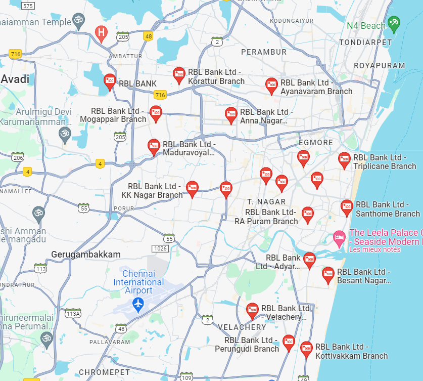
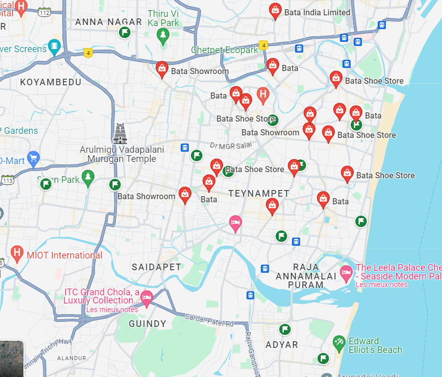
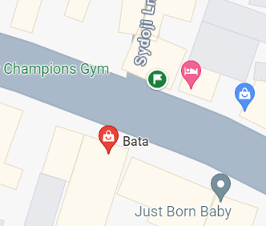

# WriteUps Lost Friend

## 1. Image analysis

In the image, we can deduce that we are **India** thanks to the yellow tuk-tuk in the right side of the image.
Additionaly, Google image indicate the same country by reversing the image. 
The more relevant store of the road are the Bata and the RBL Bank.

## 2. Map analysis

Let's analyze all the Bata and RBL Bank locations across the country. Three states remain interesting: Bangalore, Chennai, and Bombay.
Once all the Bata stores are targeted on the map:

We need to find every RBL bank next to them.

## 3. Exact Location

Only one place gathers these two markets next to one another: **282 Bharathi Salai, Chennai, Tamil Nadu**.

Finally, you need to activate street view to have the exact position by copying the Latitude-Longitude part in the URL !

Flag : FSIIECTF{13.0585619_80.276355}
