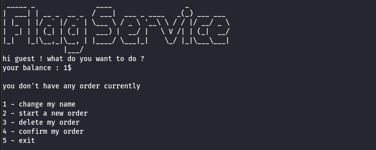

# Flagservice
## Description

Order your own flag ... If you can.

## Difficulty

Medium - a bit harder if the source is not provided

## Writeup

Connecting to the docker, we are welcomed with this menu :  



Playing around with the different options, we can see a free after use bug. In fact, when we make and order and then delete it, the values are changed.  
This means the order has been allocated on the stack, and free'd when deleted, but the pointer is still usable.


Furthermore, when we change our name, the value is once more changed.


We can then see, that the `total value` of the order is always very high, and the `nb flags` is low, and gets hirer the longer the name we give. This means the values of `total value` is overwritten before `nb flags`.  


This means we need to give a name that has it's first 4 bytes as null (or 3 null and one with 0x01 value), and then any other char that is not null. This will overwrite `total value` to 0 or 1, and `nb flags` to something higher than 0.  

Which gives the following payload :  
```py
python -c 'print("2\n100\n3\n1\n\x00\x00\x00\x00\x01\n4\n")' | nc 172.18.0.1 1339
```

Flagged !