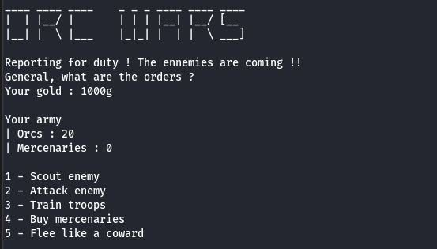
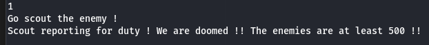
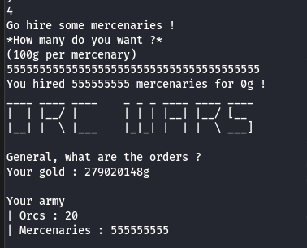

# Orc Wars

## Description

Frodon entrusted you to win the war. Defeat the Lord of the Rings!

## Difficulty

Easy

## Writeup

Connecting to the docker, we are welcomed with this menu :  

After testing the different option, we can see the goal is to get more than ~500 orcs or mercenaries to defeat the enemy.  

There is an option to buy mercenaries, but with the gold we have, we can only afford 10 of them, which isn't enough.  
We can also train some more troops, but only 10 too, so that isn't going to cut it.  

We can try to make an int overflow, by asking for a lot of mercenaries to be bought.  

We can see we bought a ton of mercenaries, for (apparently) 0 gold ! In fact, the int overflow has worked, and we can see our gold has also increased a lot. => the price for those mercenaries was negative due to the overflow.  

We then only have to attack the enemy with the new thousands of mercenaries we have, and there is the flag !
