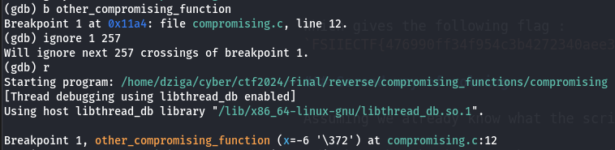

# Compromising functions  
## Description  

Looks like this mysterious binary file using two compromising functions has been leaked...  
Are you able to get the eax value at the return of the last call to the other compromising function ?  
The hash used in the flag will be the string "thekeyis:value" hashed in md5.  

## Difficulty  

Medium  

## writeup :  
Unfortunately, the challenge is kind of broken. I will show why in this writeup.  

### First way of solving (the intentional way)
We disassemble the binary file with gdb, or use ghidra to understand the description, and the script.

```
gdb compromising  
disassemble main   
```

What we need to understand, is that there are 258 calls to `other_compromising_function`. The function basically prints a random char.  
After this, we disassemble the function to get the address of the return instruction.  
  

Then we disassemble other_compromising_function and put a breakpoint at the return instruction.  

```
disassemble other_compromising_function
break other_compromising_function:82
run 
```
  

We skip 257 times the breakpoint (because there are 258 calls, and we already have stopped once).  
Finally, we print eax :


Which gives the following flag :  
`FSIIECTF{476990ff34f954c3b4272340aee33bb5}`

### Second way of solving :

Assuming we already know what the script does (same way as before with gdb and/or ghidra).  

We make a breakpoint at other_compromising_function, ignore it 257 times and run the script :  

  

We use `layout asm` to "see" at which instruction we are located, and move 23 steps forward to go to the return instruction, and we print $eax.  


We get a different $eax value, thus a diffferent flag !  

### Conclusion

I assume there is something I don't understand in how the registers work in GDB.   
With some tests, i have seen that the $eax value is the same independently of the position in the function where you break. It changes only when you manually input the steps (tested with different binaries too).  
I don't know if it's a weird GDB behaviour or if I just don't know really what $eax is. I am open to any help with this !  
Finally, This challenge idea was probably no the best.  
 

### Credits
The challenge idea was taken from [picoCTF](https://play.picoctf.org/practice/challenge/396?category=3&page=2).  
Thanks to Alex aka Red for sending me his output so i could figure this out.  